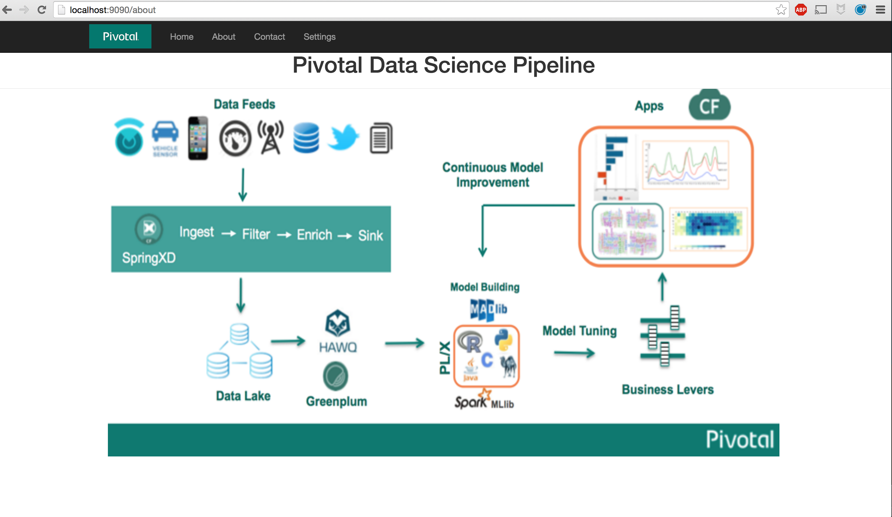

Projects using this template
=============================

* [Topic and Sentiment Analysis Engine](https://github.com/pivotalsoftware/tasa)
* [Content Based Image Retrieval](https://github.com/gautamsm/cbirapp/)
* [Lateral Movement Detection](https://github.com/pivotalsoftware/dsmlatmov)
* [Predictive Maintenance for Drilling Operations](https://github.com/pivotalsoftware/dsmiot)


Boilerplate for Flask Apps for Data Science on PCF
===================================================

This repo contains boilerplate code to build your apps on PCF using Flask and psycopg2.
You can checkout this repo into a remote empty repo of your own on GitHub or elsewhere, and customize it appropriate to spin up your own app.
For instance, to use this boiletplate as the building block for your own PCF app, you can do the following:

1. Create an empty repo on GitHub, let's call it MyApp and let's say it's URL is `https://github.com/vatsan/myapp.git`
2. Run `git clone https://github.com/vatsan/dspcfboilerplate.git`. This will clone the boilerplate repo into a local folder on your machine.
3. Rename the cloned repo to whatever you choose it to be (ex: myapp) `mv dspcfboilerplate myapp`
4. From your renamed directory containing the boilerplate (`myapp`), run the following to push the boilerplate code to your newly created GitHub repo `myapp`

        git remote rm origin
        git remote add origin https://github.com/vatsan/myapp.git
        git push origin master


Now your repo `myapp`, will contain the boilerplate code. You may start customizing this repo for your app going forward (ex: changing application name, author, contact info, images etc.)

Pre-requisites
==============

The `conda_requirements.txt` file lists all the python packages that are available via `conda` and are pre-requisites for this app.
The `requirements.txt` file lists all python packages that are only available through `pip` and are pre-requisities for this app.

Code Organization
==================

    dspcfboilerplate/ # root level folder containing all package files & app files
        README.md # This file
        conda_requirements.txt # file containing all `conda` packages needed by this app.
        requirements.txt # file containing all `pip` packages needed by this app (not available via `conda`)
        deploy # bash script to deploy this app (either locally or on PCF)
        setup.py # python packaging tools
        MANIFEST.in #Manifest file for python packaging (what files to include into the python package)
        LICENSE.txt #License for this app    
        dspcfapp/
            server.py #Main module containing all controller code
            static/
               css/ #All user specified css. These will be bundled & minified into "gen/user_css.css" by Flask-Assets.    
               data/   
               img/    
               js/ #All user specified javascript. These will all be bundled & minified into "gen/user_js.js" by Flask-Assets.    
               vendor/ #All bootstrap.js related files (css & javascript)
            templates/ #HTML templates
               layout.html  #Base layout from which every page will inherit. This also contains javascript & css inserts
               home.html #home page template
               about.html #about page template
               contact.html #contact page template


Starting the app locally
========================

1. Create a file ```dspcfapp/user.cred``` with the relevant database access credentials like the following. This file will not be added to your version control (the `.gitignore` file will filter it out):

        [database_creds]
        host: <YOUR HOSTNAME>
        port: <YOUR PORT>
        user: <YOUR USERNAME>
        database: <YOUR DATABASE>
        password: <YOUR PASSWORD>


2. Ensure your local machine can talk to the environment where the data resides in (ex: you may need to connect to a VPN if your data resides on a BDS cluster behind a firewall).
3. Run the following from the root directory

        ./deploy

This will bring up the app on `http://localhost:9090`

Pushing the app to PCF with user-provided service
==================================================

A user-provided service to let your app know what database, host and port to connect to using what credentials.
If you are doing all your datascience on a Greenplum or HAWQ cluster, this is the preferred way of binding your app to the cluster.

1. Create User Provided Service for database credentials (first time only)

        dsmiot [master●●] cf cups dspcfboilerplatecreds -p '{"host":"<HOST>","user":"<USER>","password":"<PASSWORD>", "database":"<DATABASE>", "port":"<PORT>" }'

2. Push the app to your PCF instance (assuming you've set one up)

        dsmiot [master●●] cf push dspcfboilerplate  -f manifest.yml    

3. Bind the User Provided Service to the app (first time only)

        dsmiot [master●●] cf bind-service dspcfboilerplate dspcfboilerplatecreds

The app should now be accessible on your PCF instance. 

Pushing the app to PCF with ElephantSQL as a service
=====================================================

If you are running your app on PWS (run.pivotal.io) and would like to bind your app to say a `tiny turtle` ElephantSQL service you may have created, you can follow these steps:

1. Edit the dspcfboilerplate/deploy file and change the environment variable `SERVICE_NAME` to the name of your ElephantSQL service instance(ex: `elephantsql-dev`)

2. Push the app to your PCF instance

        dsmiot [master●●] cf push dspcfboilerplate  -f manifest.yml

3. Bind your ElphantSQL service to your app (first time only)
	
        dsmiot [master●●] cf bind-service dspcfboilerplate elephantsql-dev
 
Your app will now use your ElephantSQL service as the backend database to connect to.

Screenshots
============

Here are some sample screenshots of the boilerplate app in action:





